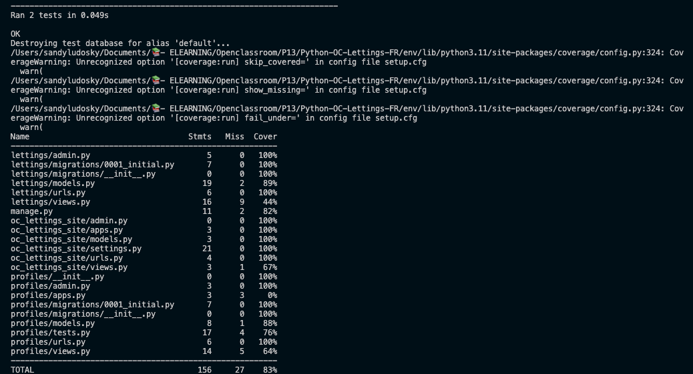

  

**Master Branch :**     |    **Dev Branch :** 

## Résumé

Site web d'Orange County Lettings

## Développement local

### Prérequis

- Compte GitHub avec accès en lecture à ce repository
- Git CLI
- SQLite3 CLI
- Interpréteur Python, version 3.6 ou supérieure

Dans le reste de la documentation sur le développement local, il est supposé que la commande `python` de votre OS shell exécute l'interpréteur Python ci-dessus (à moins qu'un environnement virtuel ne soit activé).

### MacOs / Linux

#### Cloner le repository

- `cd /path/to/put/project/in`
- `git clone https://github.com/OpenClassrooms-Student-Center/Python-OC-Lettings-FR.git`

#### Créer l'environnement virtuel

- `cd /path/to/oc_lettings_site`
- `python -m venv`
- `apt-get install python3-venv` (Si l'étape précédente comporte des erreurs avec un paquet non trouvé sur Ubuntu)
- Activer l'environnement `source venv/bin/activate`
- Confirmer que la commande `python` exécute l'interpréteur Python dans l'environnement virtuel
`which python`
- Confirmer que la version de l'interpréteur Python est la version 3.6 ou supérieure `python --version`
- Confirmer que la commande `pip` exécute l'exécutable pip dans l'environnement virtuel, `which pip`
- Pour désactiver l'environnement, `deactivate`

#### Exécuter le site

- `cd /path/to/oc_lettings_site`
- `source venv/bin/activate`
- `pip install --requirement requirements.txt`
- `python manage.py runserver`
- Aller sur `http://localhost:8000` dans un navigateur.
- Confirmer que le site fonctionne et qu'il est possible de naviguer (vous devriez voir plusieurs profils et locations).

#### Linting

- `cd /path/to/oc_lettings_site`
- `source venv/bin/activate`
- `flake8`

#### Tests unitaires

- `source venv/bin/activate`
- `cd /path/to/oc_lettings_site/letting`
- `cd /path/to/oc_lettings_site/profiles`
- `pytest`

#### image docker

`export PATH="$PATH:/Applications/Docker.app/Contents/Resources/bin/"`

`docker run -p 8000:8000 listings`

#### push sur docker

`docker push / docker pull sandra975/listings`

#### Tests Coverage
`coverage run manage.py test`
`coverage report`
`coverage html`

resultat :

